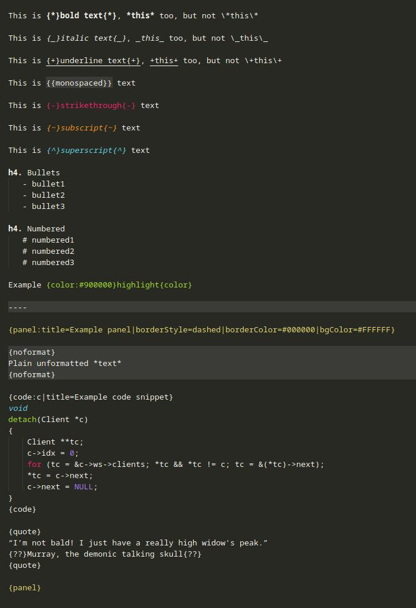

This repository provides a series of Sublime Text snippets that are specifically related to
Atlassian Jira formatting syntax.

[Sublime Text](https://www.sublimetext.com/) is a text editor and a
[snippet](https://sublime-text-unofficial-documentation.readthedocs.io/en/sublime-text-2/extensibility/snippets.html)
can be thought of as predefined text and is often used to write out template text or code. Atlassian
[Jira](https://www.atlassian.com/software/jira) is many things but first and foremost it is an issue
tracker type of software.

Preparing text in the Jira comment box in your browser is generally perfectly fine but depending on
what you are writing up and for what purpose it may occasionally be worth doing the bulk of the work
in an editor instead. If you have ever lost significant time because something went wrong the very
moment you clicked that button to add an update then you probably understand this use case.

The snippets here can be used for example to add \{\*\} around the selected text to make it bold.
In this scenario the snippet will ignore leading and trailing spaces in the selected text as Jira's
formatting handler does not handle a \{\*\} followed by a space very well.

Snippets are usually placed in the following directory:
   - \~/.config/sublime-text/Packages/User/ (Linux)

The [jira.sublime-syntax](https://github.com/bakkeby/sublime-text-jira-snippets/blob/master/User/jira.sublime-syntax)
file provides syntax highlighting for .jira files.

The colours and what is being highlighted depends on the colour scheme used in sublime text.

Example:



Example keybindings:

```json
	{
		"keys": ["alt+m"],
		"command": "insert_snippet",
		"args": { "name": "Packages/User/jira_escape.sublime-snippet" },
		"context": [{ "key": "selector", "operator": "equal", "operand": "text.jira" }]
	},
	{
		"keys": ["alt+n"],
		"command": "insert_snippet",
		"args": { "name": "Packages/User/jira_escape_monospace_quote.sublime-snippet" },
		"context": [{ "key": "selector", "operator": "equal", "operand": "text.jira" }]
	},
	{
		"keys": ["alt+o"],
		"command": "insert_snippet",
		"args": { "name": "Packages/User/jira_panel1.sublime-snippet" },
		"context": [{ "key": "selector", "operator": "equal", "operand": "text.jira" }]
	},
	{
		"keys": ["alt+p"],
		"command": "insert_snippet",
		"args": { "name": "Packages/User/jira_panel2.sublime-snippet" },
		"context": [{ "key": "selector", "operator": "equal", "operand": "text.jira" }]
	},
	{
		"keys": ["alt+q"],
		"command": "insert_snippet",
		"args": { "name": "Packages/User/jira_panel3.sublime-snippet" },
		"context": [{ "key": "selector", "operator": "equal", "operand": "text.jira" }]
	},
	{
		"keys": ["alt+w"],
		"command": "insert_snippet",
		"args": { "name": "Packages/User/jira_code.sublime-snippet" },
		"context": [{ "key": "selector", "operator": "equal", "operand": "text.jira" }]
	},
	{
		"keys": ["ctrl+enter"],
		"command": "insert_snippet",
		"args": { "name": "Packages/User/jira_linebreak.sublime-snippet" },
		"context": [{ "key": "selector", "operator": "equal", "operand": "text.jira" }]
	},
	{
		"keys": ["ctrl+b"],
		"command": "insert_snippet",
		"args": { "name": "Packages/User/jira_bold.sublime-snippet" },
		"context": [{ "key": "selector", "operator": "equal", "operand": "text.jira" }]
	},
	{
		"keys": ["ctrl+i"],
		"command": "insert_snippet",
		"args": { "name": "Packages/User/jira_italic.sublime-snippet" },
		"context": [{ "key": "selector", "operator": "equal", "operand": "text.jira" }]
	},
	{
		"keys": ["ctrl+u"],
		"command": "insert_snippet",
		"args": { "name": "Packages/User/jira_underline.sublime-snippet" },
		"context": [{ "key": "selector", "operator": "equal", "operand": "text.jira" }]
	},
	{
		"keys": ["ctrl+shift+s"],
		"command": "insert_snippet",
		"args": { "name": "Packages/User/jira_strikethrough.sublime-snippet" },
		"context": [{ "key": "selector", "operator": "equal", "operand": "text.jira" }]
	},
	{
		"keys": ["alt+h"],
		"command": "insert_snippet",
		"args": { "name": "Packages/User/jira_highlight.sublime-snippet" },
		"context": [{ "key": "selector", "operator": "equal", "operand": "text.jira" }]
	},
	{
		"keys": ["ctrl+m"],
		"command": "insert_snippet",
		"args": { "name": "Packages/User/jira_monospaced.sublime-snippet" },
		"context": [{ "key": "selector", "operator": "equal", "operand": "text.jira" }]
	},
	{
		"keys": ["ctrl+q"],
		"command": "insert_snippet",
		"args": { "name": "Packages/User/jira_quote.sublime-snippet" },
		"context": [{ "key": "selector", "operator": "equal", "operand": "text.jira" }]
	},
	{
		"keys": ["ctrl+l"],
		"command": "insert_snippet",
		"args": { "name": "Packages/User/jira_noformat.sublime-snippet" },
		"context": [{ "key": "selector", "operator": "equal", "operand": "text.jira" }]
	},
	{
		"keys": ["alt+l"],
		"command": "insert_snippet",
		"args": { "name": "Packages/User/jira_link.sublime-snippet" },
		"context": [{ "key": "selector", "operator": "equal", "operand": "text.jira" }]
	},
```
